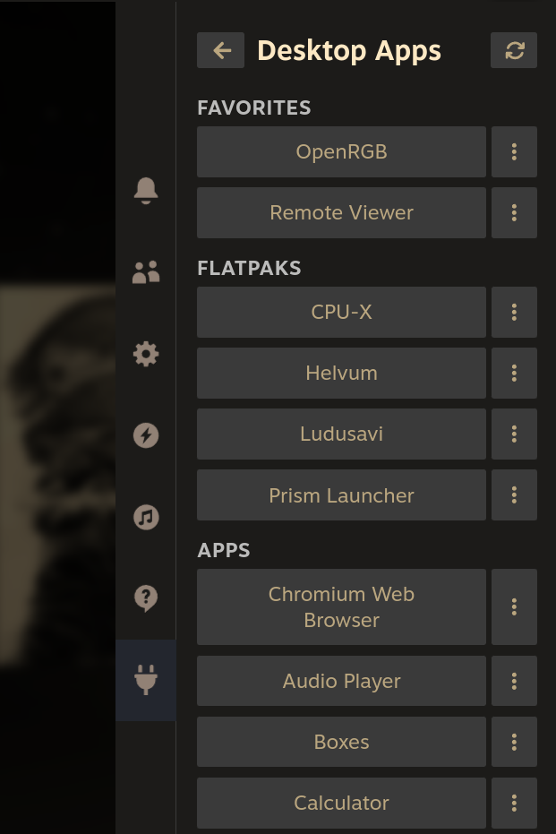
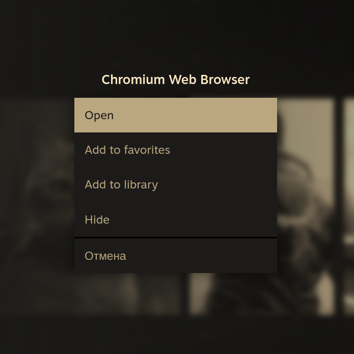

## decky-apps

Run your desktop apps from game mode without switching to desktop.

### Features

- **Browse all apps** — discovers apps from `.desktop` files across system and user directories, including Flatpaks
- **One-shot launch** — opens an app as a temporary shortcut that is automatically cleaned up after closing
- **Persistent shortcuts** — add apps to your Steam library for quick access without going through the plugin
- **Favorites** — pin frequently used apps to the top of the list
- **Hide apps** — keep the list tidy by hiding apps to the bottom of the list
- **Recently opened** — non-library apps you've used are sorted to the top
- **Crash recovery** — temporary shortcuts left behind by an unexpected shutdown are removed on next launch

### Build

```sh
make       # install deps, build, and package into build/decky-volume-mixer.zip
make build # install deps and build without packaging
make clean # remove dist and build directories
```

### Screenshots

| Main View | Options |
|:---------:|:-------:|
|  |  |
